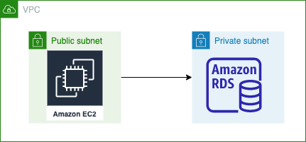

# Welcome to TheFullStackNerb.com tutorials series!
Detailed guide to create a simple CDK application
This repository is created to support the below thread


Visit my blog for more tutorials: https://thefullstacknerb.com/

Infrastructure overview:


## Bootstrap
```bash
npm run dev bootstrap
```

## Pre-deploy check
```bash
npm run dev diff
```

## Deploy
```bash
npm run dev deploy
```